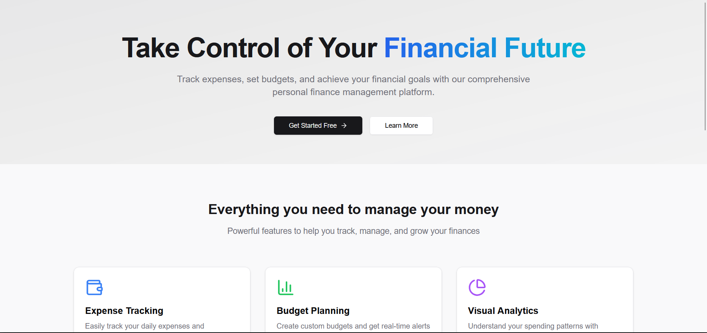

# Finance Tracker

A comprehensive finance tracker app built with **Next.js**, **MongoDB**, and **Node.js** to help you manage your expenses, track your income, and visualize your budget and spending habits. The app allows users to add, update, and delete transactions, set budgets for different categories, and get insights into their financial activity over time.




## Table of Contents
- [About](#about)
- [Getting Started](#getting-started)
- [Installation](#installation)
- [Usage](#usage)
- [Configuration](#configuration)
- [Contributing](#contributing)
- [License](#license)
- [Images](#images)


### Key Changes:
1. **Added Image Section**: I've included a section titled **Images** where you can display images from your `public` folder.
   - The images are referred using `public/images/image-name.png` (assuming they are in the `public/images` folder).
2. **Project Setup Instructions**: Clearly outlined the process for installing dependencies, setting up MongoDB, and running the app.

#### What you need to do:
- Place your images (e.g., `home-page.png`, `dashboard.png`, `budget-overview.png`) in the `public/images` directory.
- Update the file paths and names accordingly if they differ.

This `README.md` should provide clear steps for setting up and contributing to the **Finance Tracker** project!


## About

**Finance Tracker** is a web application that lets users manage their finances efficiently. It supports features like:

- Creating and deleting financial transactions (e.g., expenses, income).
- Setting budgets for different categories and tracking the remaining budget.
- Viewing spending insights over time with charts and reports.

## Getting Started

To get this project up and running locally, follow the instructions below.

### Prerequisites

Before you begin, make sure you have the following installed:

- [Node.js](https://nodejs.org/en/) (v16 or later)
- [MongoDB](https://www.mongodb.com/try/download/community) (locally or use MongoDB Atlas)
- A code editor like [VS Code](https://code.visualstudio.com/)

### Installation

1. **Clone the repository:**

   Open your terminal and run the following command:

   ```bash
   git clone https://github.com/your-username/finance-tracker.git
